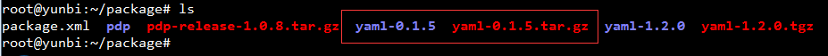
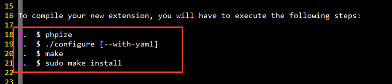

## YAML 数据序列化

### Yaml是什么？
* 是一种人们可以轻松阅读的数据序列化格式，并且它非常适合对动态编程语言中使用的数据类型进行编码。
与 XML 不同的是，YAML 使用了清晰且结构极其紧凑的指示符，这主要依赖嵌套元素的缩排。
更重要的是，对于许多任务来说，YAML 出众的语法非常适合介于 YAML 和“自然的”数据结构之间的语义

* 尽管 YAML 与 XML 一样普通，但在阅读、编辑、修改和产生方面，它比 XML 简单得多。即，您可以用 XML 表示的任何东西，都可以用 YAML 表示（几乎总是更紧凑）。

### Yaml的设计目的
> 1. 容易人类阅读
> 2. 适合表示程序语言的数据结构
> 3. 可用于不同程序间交换数据
> 4. 支持泛型工具
> 5. 支持串行处理？
> 6. 丰富的表达能力和可扩展性
> 7. 易于使用

### Yaml概述
本图摘自K.K Playin' With Web的[博客](http://www.cnblogs.com/chwkai/archive/2009/03/01/249924.html)   


### PHP中安装Yaml扩展
* PHP手册关于[Yaml扩展](http://php.net/manual/zh/book.yaml.php)   
* PHP安装Yaml扩展请详细参考上面PHP手册中的说明，这里只做简要介绍：
  * Yaml通过[LibYAML library ](http://pyyaml.org/wiki/LibYAML) 来解析和编码，所以首先需要安装**LibYAML**   
  	首先在 http://pyyaml.org/wiki/LibYAML 下载 `yaml-0.1.5.tar.gz`

  然后，`tar -zxv -f yaml-0.1.5.tar.gz` 解压

  最后，安装：
  ```
  ./configure
  $ make
  # make install 或 $ sudo make install
  ```
  * 下载Yaml   
  在PECL中[YAML](http://pecl.php.net/package/yaml)下载  

  * 解压、安装Yaml   
  执行 `tar -zxv -f yaml-1.2.0.tgz`

  阅读`README`了解安装信息（Linux安装软件一般情况下首先阅读README了解安装相关信息）   

  * 重启服务器，查看phpinfo   
 
  * 写一个php文件：yaml.php  
  使用`yaml_parse_file`来测试是否可以解析一个yaml可是的文件   

### Yaml相关帮助资料 
如果对Yaml的写法格式不了解，可以参考下面这些帮助资料，本文这里就不做赘述。  
* [百度百科-YAML](http://baike.baidu.com/link?url=rK5kQO7X593cEbwo18C7cVmvHD0vrqQFP-eANTsLJfMioFKHKssx9G1E8ZUUmqhJxo_AFOd9I_JN9Ulp7yJB-a)
* K.K Playin' With Web的博客：[初探YAML](http://www.cnblogs.com/chwkai/archive/2009/03/01/249924.html)
* [YAML 简介](http://www.ibm.com/developerworks/cn/xml/x-cn-yamlintro/)  
* [XML 问题: YAML 对 XML 的改进](http://www.ibm.com/developerworks/cn/xml/x-matters/part23/)