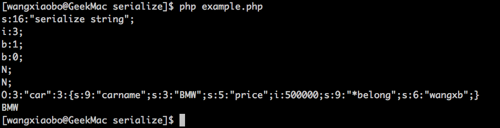

# serialize - php序列话变量

serialize — 产生一个可存储的值的表示。

## 函数原型

```
string serialize ( mixed $value )

```

serialize() 返回字符串，此字符串包含了表示 value 的**字节流**，可以**存储于任何地方**。

## 优点 

* serialize() 可处理除了 resource 之外的任何类型

* 存储或传递 PHP 的值，同时不丢失其类型和结构

## 序列化后字符串结构 

* 字符串－String   
    s:size:value; (s-字符串; size-字符串长度; value-字符串值)   

* 整型 － Integer    
    i:value; （i-整数；value－值）  
    
* 布尔型 － Boolean   
    b:value;（b－布尔值；value－0：false／1: true）
    
* Null或者变量不存在   
    N;
    
* 数组－Array   
    a:size:{key definition;value definition;(repeated per element)}
    
* 对象－Object   
    O:strlen(object name):object name:object size:{s:strlen(property name):property name:property definition;(repeated per property)}
    
* 注意：   
    字符串的值总是在双引号中    
    数组的键值总是 整型或者字符串；不能用数组作为另一个数组的某个键的键值，
    > Array keys are always integers or strings
    "null => 'value'" equates to 's:0:"";s:5:"value";',
    "true => 'value'" equates to 'i:1;s:5:"value";',
    "false => 'value'" equates to 'i:0;s:5:"value";',
    "array(whatever the contents) => 'value'" equates to an "illegal offset type" warning because you can't use an
    array as a key; however, if you use a variable containing an array as a key, it will equate to 's:5:"Array";s:5:"value";',
     and
    attempting to use an object as a key will result in the same behavior as using an array will.
   
* 实例 － example.php     
    需要说明的是，serialize会保存变量的结构，所以在对一个被serialize的变量执行unserialize后，等到的变量依然可以执行原对象的所有方法和属性，也就是说这个unserialize后的对象和serialize之前的一模一样。    
    
    输出：    
         
    
* serialize 在保存变量时由于要保存变量的结构，所以存储空间会变大。
    
## serialize存储注意    

serialize 并不适合存储在数据库中，因为这阻止了应用的可以移植性。仔细想想：数据库应该只是保存数据的，而不应该保存太多的与某一语言相关的东西。当人这并不是说不可以保存，serialize序列化后的数据是字符串，你可以保存在任何地方，只要你需要清楚的知道这一点会不会对你的应用构成后续开发的困难。   

> Please! please! please! DO NOT serialize data and place it into your database. Serialize can be used that way, but that's missing the point of a relational database and the datatypes inherent in your database engine. Doing this makes data in your database non-portable, difficult to read, and can complicate queries. If you want your application to be portable to other languages, like let's say you find that you want to use Java for some portion of your app that it makes sense to use Java in, serialization will become a pain in the buttocks. You should always be able to query and modify data in the database without using a third party intermediary tool to manipulate data to be inserted. 

> I've encountered this too many times in my career, it makes for difficult to maintain code, code with portability issues, and data that is it more difficult to migrate to other RDMS systems, new schema, etc. It also has the added disadvantage of making it messy to search your database based on one of the fields that you've serialized. 

> That's not to say serialize() is useless. It's not... A good place to use it may be a cache file that contains the result of a data intensive operation, for instance. There are tons of others... Just don't abuse serialize because the next guy who comes along will have a maintenance or migration nightmare.

serialize 更适合用在缓存文件(cache file)来包含一些数据操作的结果   


    

    
    


